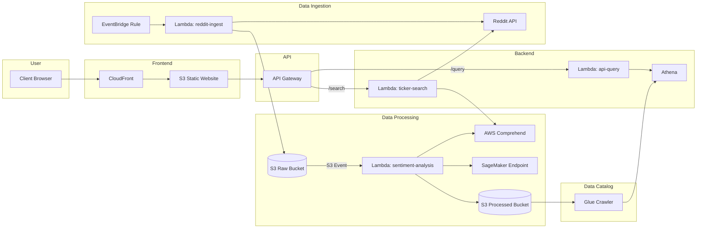

# SentimentAlpha

[](https://aws.amazon.com/)
[](https://www.terraform.io/)
[](https://www.python.org/)
[](https://aws.amazon.com/sagemaker/)
[](https://aws.amazon.com/api-gateway/)
[](https://aws.amazon.com/lambda/)

A production-ready, event-driven data pipeline that ingests Reddit investment discussions, enriches them with multi-layered NLP insights, and exposes the data via a secure, scalable API and an interactive web dashboard.

---

## Table of Contents
- [Project Overview](#project-overview)
- [Architecture](#architecture)
- [Key Features](#key-features)
- [Tech Stack & Rationale](#tech-stack--rationale)
- [Data Pipeline Deep Dive](#data-pipeline-deep-dive)
- [Machine Learning Component](#machine-learning-component)
- [Getting Started](#getting-started)
  - [Prerequisites](#prerequisites)
  - [Configuration](#configuration)
  - [Deployment](#deployment)
- [Repository Structure](#repository-structure)
- [Future Enhancements](#future-enhancements)

## Project Overview

This project tackles the challenge of extracting structured, actionable signals from the high volume of noisy, unstructured data on investment-focused subreddits. It implements a fully serverless AWS data pipeline that automates the entire process from data ingestion and NLP enrichment to data warehousing, querying, and visualization.

The core of the project is an event-driven architecture that is highly scalable, resilient, and cost-efficient, making it suitable for handling the unpredictable, spiky nature of social media data. The entire infrastructure is defined using Terraform, enabling consistent, reproducible deployments and demonstrating best practices in Infrastructure as Code (IaC).

## Architecture

The pipeline is designed with decoupled components that communicate through S3 events, ensuring resilience and scalability.



## Key Features

- **Fully Serverless Architecture**: No servers to manage. The system automatically scales with demand and you only pay for what you use.
- **Event-Driven & Decoupled**: S3 events trigger processing, creating a resilient and asynchronous data pipeline.
- **Infrastructure as Code (IaC)**: The entire AWS infrastructure is defined and managed using Terraform for reproducible and version-controlled deployments.
- **Dual-Layer NLP Enrichment**:
    1.  **Sentiment Analysis**: Uses AWS Comprehend for robust sentiment classification (Positive, Negative, Neutral).
    2.  **Custom Content Classification**: A custom-trained model on SageMaker classifies posts as "Informative" vs. "Emotional", providing deeper insight into the nature of the discussion.
- **Serverless Data Warehousing**: Uses AWS Glue and Amazon Athena to query processed JSON data directly from S3 with standard SQL.
- **Secure & Scalable API**: A RESTful API built with API Gateway provides secure access to the data, complete with API key authentication and rate limiting.
- **Interactive Frontend**: A static web dashboard built with HTML, CSS, and vanilla JavaScript provides data visualization and a real-time search feature.
- **Comprehensive Monitoring**: A pre-configured CloudWatch Dashboard and alarms provide deep visibility into the pipeline's performance and health.

## Tech Stack & Rationale

| Technology | Purpose | Why Chosen |
|------------|---------|------------|
| **AWS Lambda** | Serverless Compute | Perfect for event-driven tasks. Auto-scales and is highly cost-effective for spiky workloads. |
| **Amazon S3** | Data Lake Storage | Durable, scalable, and cheap storage. Acts as the central hub for the event-driven architecture. |
| **API Gateway** | Managed REST API | Provides a secure, scalable entry point for the frontend. Handles authentication, rate limiting, and CORS. |
| **Amazon Athena** | Serverless SQL Queries | Allows querying data directly in S3 without needing a database server. Schema-on-read provides flexibility. |
| **AWS Glue** | Data Catalog | Automatically discovers and catalogs the schema of the data in S3, making it available to Athena. |
| **AWS Comprehend** | Managed NLP Service | Provides a powerful, pre-trained sentiment analysis model without needing to manage any infrastructure. |
| **Amazon SageMaker**| Custom ML Platform | Used to train and deploy the custom "Informative vs. Emotional" classifier on a serverless endpoint, minimizing costs. |
| **Terraform** | Infrastructure as Code | The industry standard for defining cloud infrastructure as code, enabling versioning, collaboration, and automation. |
| **Python** | Backend Logic | The primary language for AWS Lambda due to its rich data science ecosystem (Boto3, PRAW) and fast cold-start times. |
| **JavaScript (Vanilla)** | Frontend Logic | Powers the interactive dashboard, fetching data from the API and rendering charts using Chart.js. |

## Data Pipeline Deep Dive

1.  **Ingest**: A scheduled EventBridge rule triggers the `reddit-ingest` Lambda. It fetches the latest posts from target subreddits, applies heuristic filters (score, length), and writes the raw JSON data to the `altdata-raw` S3 bucket. It uses SSM Parameter Store to track the timestamp of the last post to prevent duplicates.

2.  **Process**: The file upload to the raw S3 bucket triggers the `sentiment-analysis` Lambda. This function reads the raw text and enriches each post by calling AWS Comprehend for sentiment and the custom SageMaker endpoint for content type. The enriched data is then saved as newline-delimited JSON (NDJSON) to the `altdata-processed` bucket.

3.  **Catalog**: A daily AWS Glue Crawler scans the processed data, infers its schema, and updates the Glue Data Catalog.

4.  **Query**: The `api-query` Lambda is invoked by the API Gateway. It runs pre-defined SQL queries against the Glue catalog using Athena to aggregate sentiment trends and fetch recent posts. A separate `ticker-search` Lambda provides a real-time search capability by querying the Reddit API directly.

5.  **Present**: The static frontend hosted on S3 calls the API Gateway to fetch the data and visualizes it using Chart.js, providing an interactive experience for the user.

## Machine Learning Component

A key feature of this project is the custom ML model that goes beyond simple sentiment analysis.

- **Problem**: Sentiment alone doesn't tell the whole story. A highly positive post could be an emotional "to the moon!" comment or an informative piece of due diligence.
- **Solution**: A text classification model was trained using SageMaker to categorize posts as either **Informative** (e.g., news, analysis, earnings reports) or **Emotional** (e.g., hype, frustration, memes).
- **Training**: The model is a fine-tuned DistilBERT from the Hugging Face library. The training script (`sagemaker/train.py`) handles data preparation, training, and evaluation.
- **Deployment**: The trained model is deployed to a **SageMaker Serverless Endpoint**, which automatically scales based on demand (including to zero), making it extremely cost-effective for a project with variable traffic.

## Getting Started

Follow these instructions to deploy the entire infrastructure to your own AWS account.

### Prerequisites

- An AWS Account and configured AWS CLI
- Terraform v1.0+ installed
- Python 3.9+
- A Reddit API App (for `client_id` and `client_secret`)

### Configuration

1.  **Clone the Repository**:
    ```bash
    git clone [https://github.com/your-username/your-repo-name.git](https://github.com/your-username/your-repo-name.git)
    cd your-repo-name
    ```

2.  **Set up Reddit API Credentials**: Store your Reddit API `client_id` and `client_secret` in AWS Secrets Manager with the secret name `reddit-api-credentials`.
    ```powershell
    # Example using PowerShell
    $secret = @{ client_id = "YOUR_CLIENT_ID"; client_secret = "YOUR_CLIENT_SECRET" } | ConvertTo-Json -Compress
    aws secretsmanager create-secret --name "reddit-api-credentials" --secret-string $secret
    ```

3.  **Configure Terraform Variables**: Create a `terraform.tfvars` file inside the `terraform/` directory.
    ```terraform
    # terraform/terraform.tfvars
    aws_region      = "us-east-1"
    alert_email     = "your-email@example.com"
    # Add any other variable overrides here
    ```

### Deployment

1.  **Initialize Terraform**:
    ```bash
    cd terraform
    terraform init
    ```

2.  **Build Lambda Packages**: Run the `build.ps1` script in each Lambda directory to install dependencies and create the `.zip` deployment packages.
    ```powershell
    # Example for one Lambda
    cd ../lambda_reddit_ingest
    ./build.ps1
    # Repeat for all other lambda_* directories
    ```

3.  **Plan and Apply**:
    ```bash
    cd ../terraform
    terraform plan
    terraform apply --auto-approve
    ```
    Terraform will now provision all the AWS resources. This may take 10-15 minutes.

4.  **Update Frontend Config**: After deployment, Terraform will output the `api_endpoint_url` and `api_key_value`. Update the `frontend/config.js` file with these values. Terraform will automatically upload the updated frontend files to S3.

5.  **Access Your Dashboard**: Navigate to the `frontend_website_url` from the Terraform output to see your dashboard live!

## Repository Structure

```
.
├── frontend/               # Static HTML, CSS, JS for the web dashboard
├── lambda_api_query/       # Lambda for querying Athena
├── lambda_reddit_ingest/   # Lambda for ingesting data from Reddit
├── lambda_sentiment_analysis/ # Lambda for NLP enrichment
├── lambda_ticker_search/   # Lambda for real-time ticker searches
├── sagemaker/              # Scripts for training and deploying the ML model
├── terraform/              # All Terraform IaC files
├── athena_queries/         # Sample SQL queries for Athena
└── README.md               # This file
```

## Future Enhancements

- **Real-time Streaming**: Replace the batch ingestion with a real-time pipeline using Amazon Kinesis for sub-minute data freshness.
- **Advanced ML Models**: Fine-tune a larger language model (LLM) for more nuanced sentiment and topic modeling.
- **Multi-Source Ingestion**: Add connectors for other data sources like Twitter, Discord, or financial news APIs.
- **CI/CD Pipeline**: Implement a GitHub Actions workflow to automatically build, test, and deploy infrastructure and code changes.
